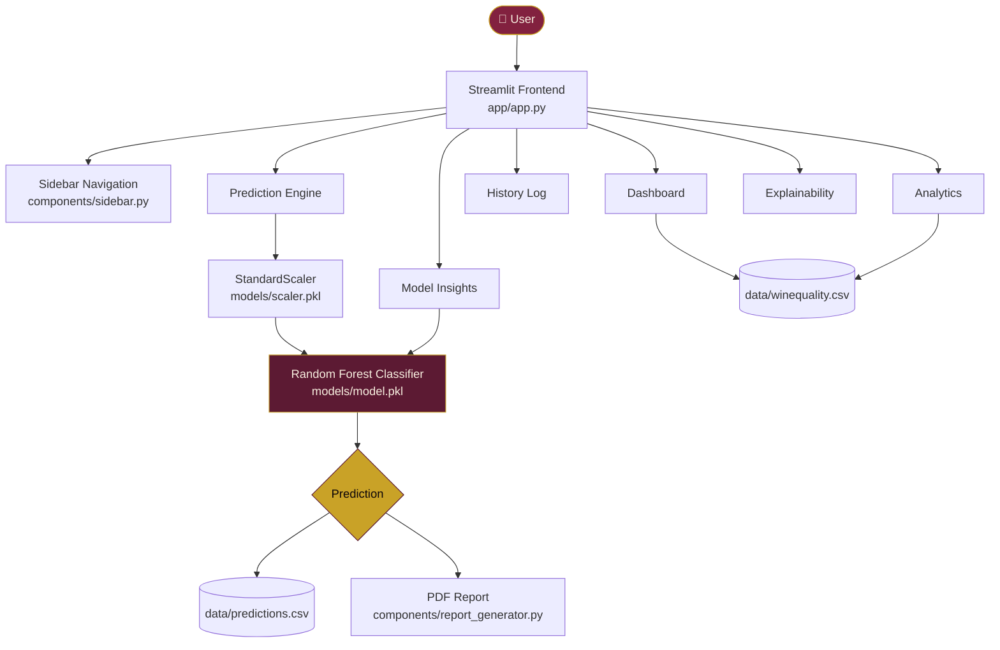
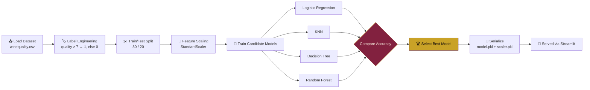
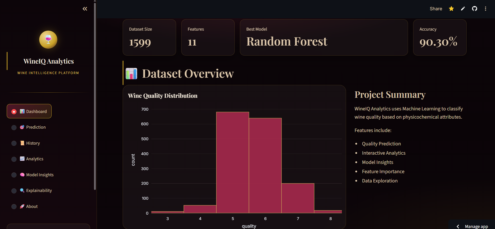
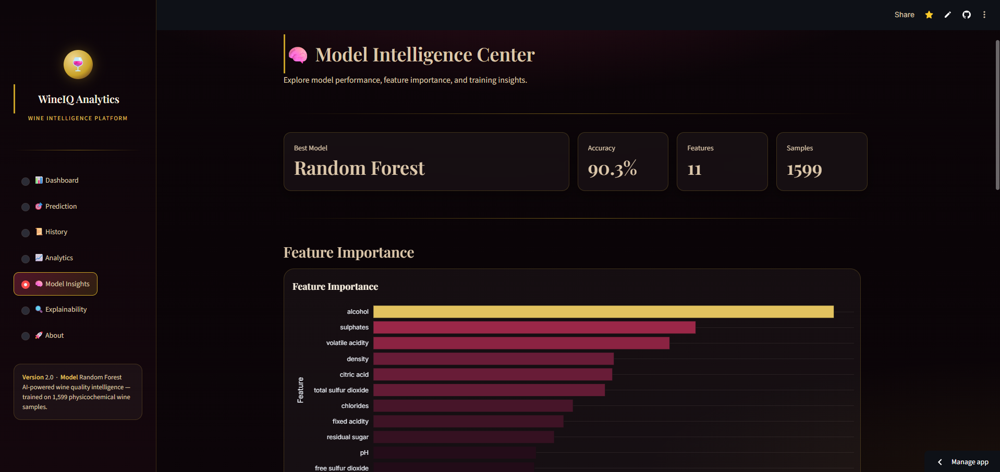

<div align="center">


# 🍷 WineIQ Analytics

### AI-Powered Wine Quality Intelligence Platform

[](https://www.python.org/)
[](https://streamlit.io/)
[](https://scikit-learn.org/)
[](LICENSE)
[](https://github.com/saddihemanth/WineIQ-Analytics/issues)
[](https://github.com/saddihemanth/WineIQ-Analytics/commits/main)
[](https://github.com/saddihemanth/WineIQ-Analytics/stargazers)

*Predicting wine quality from physicochemical attributes — built with Streamlit, scikit-learn, and Plotly.*

[Live Demo](#) · [Report Bug](https://github.com/saddihemanth/WineIQ-Analytics/issues) · [Request Feature](https://github.com/saddihemanth/WineIQ-Analytics/issues)

</div>

---

## 📑 Table of Contents

- [Overview](#-overview)
- [Problem Statement](#-problem-statement)
- [Solution Approach](#-solution-approach)
- [Features](#-features)
- [Tech Stack](#-tech-stack)
- [Architecture](#-architecture)
- [ML Workflow](#-ml-workflow)
- [Dataset](#-dataset)
- [Screenshots](#-screenshots)
- [Installation](#-installation)
- [Usage](#-usage)
- [Folder Structure](#-folder-structure)
- [Model Performance](#-model-performance)
- [Roadmap / Future Enhancements](#-roadmap--future-enhancements)
- [Contributing](#-contributing)
- [Security](#-security)
- [License](#-license)
- [Author & Contact](#-author--contact)

---

## 📌 Overview

**WineIQ Analytics** is an end-to-end machine learning application that
classifies wine quality from eleven measurable physicochemical properties
(acidity, sulphates, alcohol content, pH, and more). It combines a trained
classification model with an interactive Streamlit dashboard for real-time
predictions, exploratory analytics, and model interpretability — packaged
as a single, portfolio-ready project.

## 🎯 Problem Statement

Wine quality assessment is traditionally performed by expert tasters through
sensory evaluation — a process that is **subjective, slow, and expensive to
scale**. Producers and quality-control teams need a faster, consistent way
to flag wines for review before they ever reach a human palate.

## 💡 Solution Approach

WineIQ Analytics reframes wine quality as a **binary classification problem**:
a wine is labeled *high quality* (score ≥ 7) or *standard quality* (score < 7)
based on its physicochemical profile. Four candidate models are trained and
compared (Logistic Regression, KNN, Decision Tree, Random Forest); the
best-performing model is serialized and served through an interactive
dashboard so anyone — not just a data scientist — can get an instant
prediction and understand *why* the model reached that conclusion.

## ✨ Features

| Module | Capabilities |
|---|---|
| 📊 **Dashboard** | Animated KPI cards, dataset preview, quality distribution & correlation visualizations |
| 🎯 **Prediction Engine** | Real-time input form → scaled inference → class prediction with confidence context |
| 📜 **History** | Persistent log of past predictions with summary stats and CSV export |
| 📈 **Analytics** | Tabbed distribution, correlation, and an interactive column explorer with CSV download |
| 🧠 **Model Insights** | Feature importance, multi-model accuracy comparison, business-readable takeaways |
| 🔍 **Explainability** | Feature contribution breakdown for transparent, interpretable predictions |
| 📄 **PDF Reporting** | One-click, branded PDF report generation per prediction |
| 🎨 **Premium UI** | Custom "Cellar at Midnight" theme — glassmorphism cards, gradient typography, hover micro-interactions, fully responsive |

## 🛠 Tech Stack

<div align="center">

| Layer | Technology |
|---|---|
| **Frontend** | Streamlit, custom CSS (glassmorphism, CSS variables, Google Fonts) |
| **Visualization** | Plotly Express / Graph Objects |
| **Machine Learning** | scikit-learn (Logistic Regression, KNN, Decision Tree, Random Forest) |
| **Data Processing** | Pandas, NumPy |
| **Model Persistence** | Joblib |
| **Reporting** | ReportLab (PDF generation) |
| **Explainability** | SHAP *(scaffolded, see [Roadmap](ROADMAP.md))* |
| **CI** | GitHub Actions |

</div>

## 🏗 Architecture



## 🤖 ML Workflow



Run the pipeline yourself:

```bash
python train.py
```

## 📊 Dataset

This project uses the [UCI Wine Quality dataset](https://archive.ics.uci.edu/dataset/186/wine+quality) (red wine subset).

| | |
|---|---|
| **Samples** | 1,599 |
| **Features** | 11 physicochemical attributes |
| **Target** | Quality score (0–10), binarized at ≥ 7 |

<details>
<summary>Feature list</summary>

`fixed acidity` · `volatile acidity` · `citric acid` · `residual sugar` ·
`chlorides` · `free sulfur dioxide` · `total sulfur dioxide` · `density` ·
`pH` · `sulphates` · `alcohol`

</details>

## 📸 Screenshots

> Add real screenshots to `screenshots/` and update the paths below —
> see the suggested filenames already wired in.

| Dashboard | Prediction |
|---|---|
|  |  |

| Analytics | Model Insights |
|---|---|
|  |  |

<details>
<summary>How to capture these</summary>

1. Run the app locally: `streamlit run app/app.py`
2. Navigate to each page and capture a full-window screenshot
3. Save into `screenshots/` using the filenames above
   (`dashboard.png`, `prediction.png`, `analytics.png`, `model_insights.png`)

</details>

## ⚙ Installation

**Prerequisites:** Python 3.10+

```bash
# 1. Clone the repository
git clone https://github.com/saddihemanth/WineIQ-Analytics.git
cd WineIQ-Analytics

# 2. Create and activate a virtual environment
python -m venv .venv
source .venv/bin/activate        # Windows: .venv\Scripts\activate

# 3. Install dependencies
pip install -r requirements.txt

# 4. Train the model (writes models/model.pkl and models/scaler.pkl)
python train.py

# 5. Launch the app
streamlit run app/app.py
```

The app will be available at `http://localhost:8501`.

## ▶ Usage

1. **Dashboard** — get an at-a-glance view of dataset size, model accuracy,
   and quality distribution.
2. **Prediction** — enter a wine's chemical properties and click
   **Predict Wine Quality** to get an instant classification, then
   optionally generate a PDF report.
3. **History** — review every prediction made in this session/deployment.
4. **Analytics** — explore distributions, correlations, and filter the raw
   dataset interactively.
5. **Model Insights** — compare model accuracy and inspect which features
   drive predictions.
6. **Explainability** — see a transparent breakdown of feature contributions.

## 📁 Folder Structure

```
WineIQ-Analytics/
│
├── app/
│   ├── app.py                  # Page routing & layout
│   ├── assets/
│   │   └── styles.css          # "Cellar at Midnight" design system
│   └── components/
│       ├── sidebar.py          # Branded nav
│       ├── metrics.py          # Animated KPI cards
│       ├── charts.py           # Themed Plotly chart factory
│       ├── history.py          # Prediction history persistence
│       ├── report_generator.py # PDF report builder
│       └── explainability.py   # SHAP scaffolding (see Roadmap)
│
├── assets/                     # README/brand assets (banner.svg, logo.svg)
├── data/                       # winequality.csv, predictions.csv (generated)
├── models/                     # model.pkl, scaler.pkl (generated)
├── notebooks/                  # Wine_Analysis.ipynb — EDA
├── screenshots/                # README screenshots
├── .github/workflows/          # CI (train-on-push)
│
├── train.py                    # Model training pipeline
├── config.example.yml          # Safe template (see SECURITY.md)
├── requirements.txt
├── README.md
├── LICENSE
├── CONTRIBUTING.md
├── CODE_OF_CONDUCT.md
├── SECURITY.md
├── SUPPORT.md
├── CHANGELOG.md
└── ROADMAP.md
```

## 🏆 Model Performance

| Model | Accuracy |
|---|---|
| Logistic Regression | 86.5% |
| K-Nearest Neighbors | 88.1% |
| Decision Tree | 87.2% |
| **Random Forest** ⭐ | **90.3%** |

**Key drivers of quality** (by feature importance): alcohol, sulphates, and
citric acid correlate positively with quality; high volatile acidity
correlates negatively.

## 🚀 Roadmap / Future Enhancements

See [ROADMAP.md](ROADMAP.md) for the full plan. Highlights:

- Real SHAP-based explainability (waterfall/force plots)
- Authentication wired through `streamlit-authenticator`
- Batch prediction via CSV upload
- Dockerized deployment + CI test suite

## 🤝 Contributing

Contributions are welcome! Please read [CONTRIBUTING.md](CONTRIBUTING.md)
for setup instructions, coding standards, and the PR process. This project
follows a [Code of Conduct](CODE_OF_CONDUCT.md).

## 🔐 Security

Please see [SECURITY.md](SECURITY.md) for the responsible-disclosure
process and important hardening notes (including a known plaintext-demo
credential in `config.yml` that should be replaced before deploying
authentication).

## 📄 License

Distributed under the MIT License. See [`LICENSE`](LICENSE) for details.

## 👨‍💻 Author & Contact

**Hemanth Reddy**
CSE (AI & ML)

[](https://github.com/saddihemanth)

Questions or feedback? Open an issue or see [SUPPORT.md](SUPPORT.md).

---

<div align="center">

If this project helped you, consider giving it a ⭐ — it helps others find it too.

</div>
